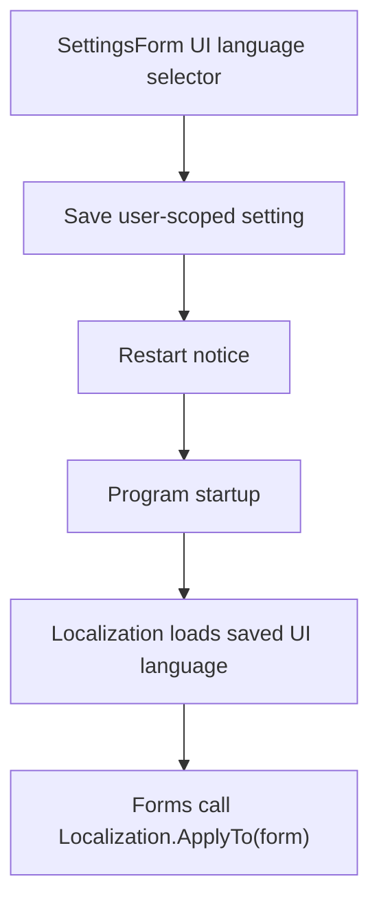

# UI Language Selection

Feature Name: ui-language-selection
Updated: 2026-06-01

## Description

Add a launcher UI language selector to the existing settings window. The selector stores the user's preferred UI language in user-scoped application settings and applies the saved language when the application starts. The first implementation supports English and Simplified Chinese with English fallback.

## Architecture

The implementation uses a small in-process localization registry rather than generated resource files. This keeps the change minimal and avoids broad designer regeneration in the existing WinForms project.

## Components and Interfaces

- `Localization`: Static helper that stores supported languages, resolves translated strings, applies form text, and falls back to English.
- `Properties.Settings.Default.UiLanguage`: User-scoped setting containing the selected UI language code.
- `SettingsForm`: Adds a UI language combo box and saves the selected value.
- Existing forms: Call `Localization.ApplyTo(this)` after `InitializeComponent()`.

## Data Models

- `UiLanguage` setting values:
  - `en`: English
  - `zh-Hans`: Simplified Chinese
- `Localization` string map:
  - English dictionary keyed by existing English UI text.
  - Simplified Chinese dictionary keyed by existing English UI text.

## Correctness Properties

- The settings window SHALL keep Steam emulator language and launcher UI language as separate controls.
- The application SHALL keep `english` as the Steam emulator language default.
- The application SHALL use English when `UiLanguage` is empty or unsupported.
- The application SHALL apply translations only to known UI strings.

## Error Handling

- Unsupported setting value: Use English.
- Missing translation: Use original English text.
- Save failure: Existing settings save behavior propagates through the settings workflow.

## Test Strategy

- Build with `dotnet build SmartGoldbergEmu.sln --configuration Release -v minimal`.
- Publish with `dotnet publish SmartGoldbergEmu.csproj --configuration Release --runtime win-x64 --self-contained true --no-build -p:PublishSingleFile=true -p:IncludeNativeLibrariesForSelfExtract=true -p:EnableCompressionInSingleFile=true -p:PublishDir=artifacts/publish/win-x64/ -v minimal`.
- Manual UI check on Windows verifies settings selector, restart prompt, and translated labels.

## References

[^1]: (SettingsForm.cs#L110) - Settings form constructor applies initialization.
[^2]: (SmartGoldbergEmuMainForm.cs#L34) - Main form constructor applies initialization.
[^3]: (Settings.settings#L4) - Existing user-scoped application settings.
